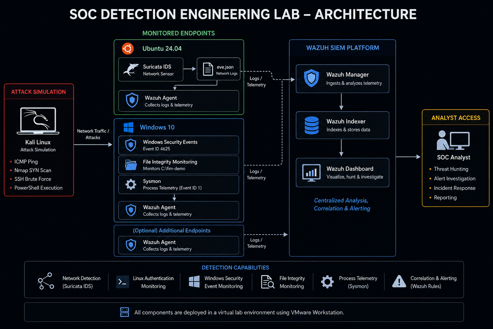

# SOC Detection Engineering Lab

A hands-on SOC detection engineering lab built using **Wazuh, Suricata, Sysmon, Windows, Ubuntu, and Kali Linux**.

The project demonstrates how suspicious activity can be generated in a controlled environment, collected as network or endpoint telemetry, detected using built-in and custom rules, correlated in a SIEM, and validated through analyst investigation and remediation analysis.

---

## Architecture



The lab combines:

- Network IDS monitoring with Suricata
- Windows and Linux endpoint telemetry
- Sysmon process telemetry
- Wazuh SIEM analysis
- Built-in detection rules
- Custom Suricata signatures
- Custom Wazuh correlation
- File Integrity Monitoring
- Controlled attack simulation
- Alert investigation and evidence collection
- Remediation analysis

Detailed architecture documentation:

[View Lab Architecture](docs/architecture.md)

---

## Detection Scenarios

| # | Detection Scenario | Detection Source | Result |
|---|---|---|---|
| 01 | ICMP Ping Detection | Suricata + Wazuh | Detected |
| 02 | TCP SYN Port Scan Detection | Suricata + Wazuh | Detected |
| 03 | SSH Brute-Force Detection | Linux Authentication Logs + Wazuh | Correlated — Level 10 |
| 04 | Windows Brute-Force Detection | Windows Security Events + Wazuh | Custom Correlation — Level 10 |
| 05 | Windows File Integrity Monitoring | Wazuh FIM | Add / Modify / Delete Detected |
| 06 | Encoded PowerShell Detection | Sysmon + Wazuh | Detected — Level 12 |

### Scenario Documentation

- [01 — ICMP Ping Detection](scenarios/01-icmp-detection.md)
- [02 — TCP SYN Port Scan Detection](scenarios/02-syn-port-scan-detection.md)
- [03 — SSH Brute-Force Detection](scenarios/03-ssh-bruteforce-detection.md)
- [04 — Windows Brute-Force Detection](scenarios/04-windows-bruteforce-detection.md)
- [05 — Windows File Integrity Monitoring](scenarios/05-windows-file-integrity-monitoring.md)
- [06 — Sysmon Encoded PowerShell Detection](scenarios/06-sysmon-encoded-powershell-detection.md)

---

## Custom Detection Engineering

### Suricata — ICMP Detection

```text
alert icmp any any -> $HOME_NET any (msg:"LAB ICMP Ping Detected"; itype:8; sid:1000001; rev:1;)
```

### Suricata — TCP SYN Scan Detection

```text
alert tcp any any -> $HOME_NET any (msg:"LAB Possible TCP SYN Port Scan"; flags:S; threshold:type both, track by_src, count 20, seconds 10; sid:1000002; rev:1;)
```

### Wazuh — Windows Brute-Force Correlation

```xml
<rule id="100100" level="10" frequency="5" timeframe="60">
  <if_matched_sid>60122</if_matched_sid>
  <description>Windows: Multiple failed logon attempts detected - Possible brute force attack.</description>
  <mitre>
    <id>T1110</id>
  </mitre>
</rule>
```

This custom rule correlates repeated Windows failed-logon events into a higher-severity brute-force alert.

### Sysmon — PowerShell Process Telemetry

Sysmon is deployed on the Windows endpoint to provide enhanced process-creation telemetry.

Sysmon Event ID `1` captured PowerShell process execution and command-line arguments. Wazuh built-in Rule `92057` detected Base64-encoded PowerShell execution and generated a Level 12 alert mapped to MITRE ATT&CK `T1059.001`.

---

## Detection Workflow

```text
Generate Controlled Activity
          |
          v
Collect Network / Endpoint Telemetry
          |
          v
Apply Detection & Correlation Logic
          |
          v
Generate Security Alert
          |
          v
Investigate in Wazuh
          |
          v
Correlate Supporting Events
          |
          v
Validate Detection
          |
          v
Document Evidence & Remediation
```

---

## Alert Investigation & Remediation

The project goes beyond alert generation by performing analyst-style investigation of selected high-severity detections.

### SSH Brute-Force Investigation

The Wazuh Level 10 SSH brute-force alert was investigated by correlating Rule `5763` with the underlying Rule `5760` authentication failures.

The investigation confirmed repeated failed authentication attempts against the `zayan` account from the same lab source.

[View SSH Brute-Force Investigation](investigations/01-ssh-bruteforce-investigation.md)

### Windows Brute-Force Investigation

The custom Windows brute-force alert was investigated by correlating Rule `100100` with the underlying Windows Event ID `4625` alerts generated by Rule `60122`.

The investigation identified repeated failed logons against the controlled `FakeSOCUser` account. The source address was `::1`, confirming that the simulated activity originated locally rather than from the Kali attack VM.

[View Windows Brute-Force Investigation](investigations/02-windows-bruteforce-investigation.md)

Both investigations include:

- Alert validation
- Event correlation
- Source and target analysis
- MITRE ATT&CK mapping
- Analyst verdict
- Recommended investigation actions
- Remediation recommendations

---

## Lab Environment

| Component | Purpose |
|---|---|
| Wazuh 4.12.0 | SIEM, event analysis, correlation, and investigation |
| Suricata 8.0.0 | Network IDS |
| Sysmon 15.21 | Windows process and endpoint telemetry |
| Kali Linux | Controlled attack simulation |
| Ubuntu 24.04 | Linux endpoint and Suricata sensor |
| Windows 10 | Monitored Windows endpoint |
| VMware Workstation 17.5.0 | Virtualization platform |

The environment runs on a Windows 11 host with limited memory, so only the virtual machines required for each scenario are powered on simultaneously.

Detailed environment documentation:

[View Lab Environment](docs/lab-environment.md)

---

## Detection Coverage

The project demonstrates:

- Network traffic detection
- ICMP monitoring
- TCP SYN port-scan detection
- Linux authentication monitoring
- SSH brute-force correlation
- Windows Security Event monitoring
- Windows Event ID `4625` analysis
- Custom SIEM correlation
- File Integrity Monitoring
- Sysmon endpoint telemetry
- Process creation monitoring
- PowerShell command-line visibility
- Encoded PowerShell detection
- MITRE ATT&CK mapping
- Detection validation
- Threat hunting in Wazuh
- Alert correlation
- Analyst investigation
- Remediation analysis

---

## Repository Structure

```text
SOC-Detection-Engineering/
│
├── configs/
│   ├── windows-fim-config.xml
│   └── windows-sysmon-wazuh-config.xml
│
├── detection-rules/
│   ├── suricata-local.rules
│   └── wazuh-windows-rules.xml
│
├── docs/
│   ├── images/
│   │   └── soc-lab-architecture.png
│   ├── architecture.md
│   └── lab-environment.md
│
├── investigations/
│   ├── 01-ssh-bruteforce-investigation.md
│   └── 02-windows-bruteforce-investigation.md
│
├── results/
│   └── detection-summary.md
│
├── scenarios/
│   ├── 01-icmp-detection.md
│   ├── 02-syn-port-scan-detection.md
│   ├── 03-ssh-bruteforce-detection.md
│   ├── 04-windows-bruteforce-detection.md
│   ├── 05-windows-file-integrity-monitoring.md
│   └── 06-sysmon-encoded-powershell-detection.md
│
├── screenshots/
│   └── Detection and investigation evidence
│
└── README.md
```

---

## Results

The lab successfully demonstrated an end-to-end detection pipeline across network, authentication, file-integrity, and endpoint process telemetry.

Key detections included:

- Custom Suricata ICMP alert
- Custom Suricata TCP SYN scan alert
- Wazuh SSH brute-force correlation
- Custom Windows brute-force correlation
- Windows file creation detection
- Windows file modification detection
- Windows file deletion detection
- Sysmon process-creation telemetry
- Encoded PowerShell execution — Wazuh Level 12

Selected high-severity alerts were further investigated by correlating the triggering alert with underlying security events and documenting analyst findings and remediation recommendations.

A consolidated detection matrix is available here:

[View Detection Summary](results/detection-summary.md)

---

## Disclaimer

This project was created for educational and defensive cybersecurity purposes.

All attack simulations were performed inside an isolated virtual lab against systems owned and controlled by the author.