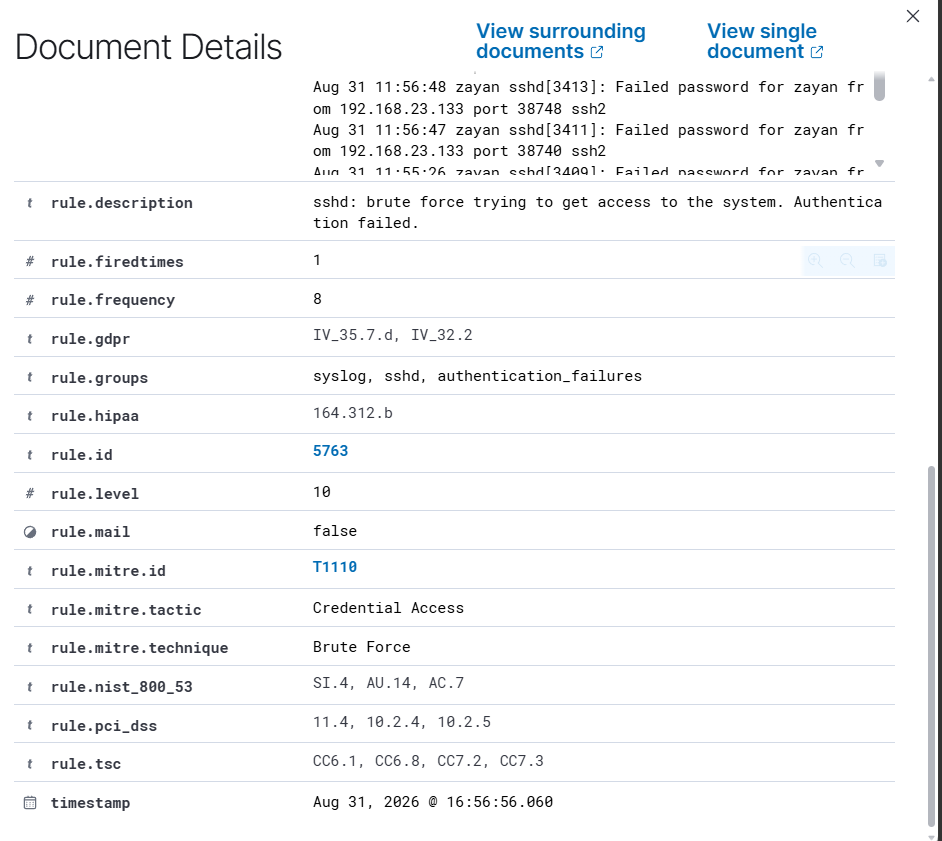
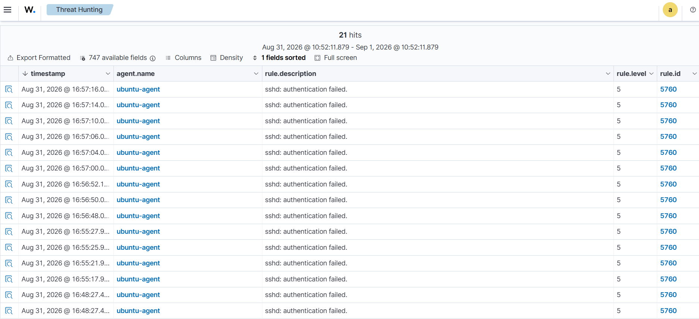

# SSH Brute-Force Alert Investigation

## Overview

This investigation analyzes an SSH brute-force alert generated by Wazuh during a controlled attack simulation in the SOC Detection Engineering Lab.

Multiple failed SSH authentication attempts were generated from the Kali Linux attacker machine against the Ubuntu server. Wazuh detected the individual authentication failures and correlated the repeated events into a high-severity brute-force alert.

---

## Alert Summary

| Field | Value |
|---|---|
| Detection Platform | Wazuh |
| Alert Rule | 5763 |
| Alert Level | 10 |
| Description | sshd: brute force trying to get access to the system. Authentication failed. |
| Source IP | 192.168.23.133 |
| Target Host | ubuntu-agent |
| Target IP | 192.168.23.131 |
| Target User | zayan |
| Service | SSH |
| Decoder | sshd |
| Correlation Frequency | 8 |
| MITRE ATT&CK Technique | T1110 - Brute Force |
| MITRE ATT&CK Tactic | Credential Access |
| Investigation Verdict | True Positive - Authorized Lab Simulation |

---

## Investigation Process

### 1. High-Severity Alert Review

The investigation started with Wazuh Rule `5763`, which generated a Level 10 alert indicating repeated SSH authentication failures.

The alert identified:

- Source IP: `192.168.23.133`
- Target IP: `192.168.23.131`
- Target account: `zayan`
- Service: `sshd`
- Correlation frequency: `8`

The source IP corresponds to the Kali Linux attacker machine used in the controlled lab.

---

### 2. Underlying Authentication Event Analysis

To determine whether the high-severity alert represented repeated authentication failures rather than an isolated event, the underlying Wazuh Rule `5760` events were reviewed.

Multiple Level 5 SSH authentication failure events occurred within a short period.

An individual authentication failure was also reviewed and confirmed:

- Source IP: `192.168.23.133`
- Target user: `zayan`

The repeated events originated from the same attack source and targeted the same account.

---

## Event Correlation

The investigation identified the following detection sequence:

1. Kali Linux generated repeated SSH login attempts against the Ubuntu server.
2. Ubuntu `sshd` recorded the failed authentication attempts.
3. Wazuh collected the authentication logs from the Ubuntu endpoint.
4. Individual failed authentication attempts triggered Wazuh Rule `5760`.
5. Repeated authentication failures were correlated by Wazuh.
6. Wazuh Rule `5763` generated a Level 10 brute-force alert.

This correlation reduced the need to manually analyze each failed login independently and highlighted the repeated activity as a higher-severity security event.

---

## MITRE ATT&CK Mapping

The alert was mapped to:

**Tactic:** Credential Access

**Technique:** T1110 - Brute Force

The observed activity is consistent with repeated authentication attempts intended to obtain access to an account by trying credentials.

---

## Analyst Assessment

**Verdict: True Positive - Authorized Lab Simulation**

The alert was determined to be a true positive because multiple SSH authentication failures were observed from the same source IP against the target account within a short period.

The activity was intentionally generated from the Kali Linux machine as part of the controlled SOC lab and therefore does not represent an actual compromise.

No evidence of successful SSH authentication was identified as part of this investigation.

---

## Recommended Remediation

In a production environment, similar activity should be investigated and contained based on the surrounding context.

Recommended actions include:

- Identify whether the source IP is authorized or expected.
- Review SSH authentication logs for successful logins following the failed attempts.
- Temporarily block or restrict a confirmed malicious source IP.
- Disable or investigate targeted accounts if compromise is suspected.
- Enforce strong password policies.
- Use multi-factor authentication where supported.
- Restrict SSH access to trusted management networks or approved source addresses.
- Consider rate limiting or tools such as Fail2ban to reduce repeated authentication attempts.
- Prefer SSH key-based authentication over password authentication where operationally appropriate.
- Continue monitoring the source IP for additional suspicious activity.

---

## Conclusion

Wazuh successfully identified and correlated repeated SSH authentication failures into a high-severity brute-force alert.

The investigation of the underlying events confirmed that the activity originated from the Kali Linux attacker machine and repeatedly targeted the `zayan` account on the Ubuntu server.

This scenario demonstrates both detection and analyst-level validation of SSH brute-force activity using endpoint authentication telemetry and Wazuh event correlation.