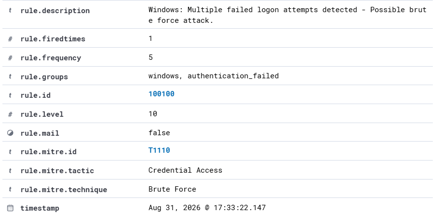
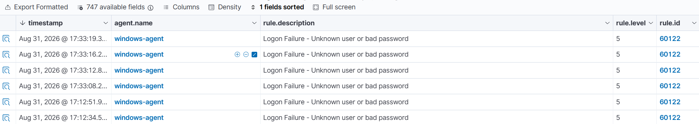

# Windows Brute-Force Alert Investigation

## Overview

This investigation analyzes a Windows brute-force correlation alert generated by a custom Wazuh detection rule during a controlled attack simulation in the SOC Detection Engineering Lab.

Multiple Windows failed-logon events were generated on the Windows endpoint. Wazuh first detected the individual authentication failures and then correlated repeated failures using a custom rule to generate a higher-severity brute-force alert.

---

## Alert Summary

| Field | Value |
|---|---|
| Detection Platform | Wazuh |
| Custom Alert Rule | 100100 |
| Alert Level | 10 |
| Correlation Frequency | 5 |
| Base Wazuh Rule | 60122 |
| Windows Event ID | 4625 |
| Target Host | windows-agent |
| Agent IP | 192.168.23.128 |
| Windows Hostname | DESKTOP-R511A42 |
| Target Account | FakeSOCUser |
| Logon Type | 2 - Interactive |
| Authentication Package | Negotiate |
| Source Address | ::1 |
| MITRE ATT&CK Technique | T1110 - Brute Force |
| MITRE ATT&CK Tactic | Credential Access |
| Investigation Verdict | True Positive - Authorized Lab Simulation |

---

## Investigation Process

### 1. High-Severity Alert Review

The investigation started with custom Wazuh Rule `100100`, which generated a Level 10 alert with the following description:

> Windows: Multiple failed logon attempts detected - Possible brute force attack.

The rule was configured to correlate repeated matches of Wazuh Rule `60122`. A frequency threshold of five failed-logon events was used to identify repeated authentication failures.

The alert was mapped to MITRE ATT&CK technique `T1110 - Brute Force` under the `Credential Access` tactic.

---

### 2. Windows Authentication Event Analysis

The underlying event was Windows Security Event ID `4625`, which represents a failed account logon.

The event details identified:

- Target account: `FakeSOCUser`
- Failure reason: Unknown user name or bad password
- Status: `0xC000006D`
- Sub-status: `0xC0000064`
- Logon type: `2`
- Authentication package: `Negotiate`
- Process: `C:\Windows\System32\svchost.exe`
- Source address: `::1`

The sub-status `0xC0000064` indicates that the specified account did not exist, which is consistent with the intentionally generated `FakeSOCUser` authentication attempts.

---

### 3. Underlying Event Correlation

Wazuh Rule `60122` detected the individual Windows failed-logon events at Level 5.

Multiple Rule `60122` alerts were observed within a short period, including events around:

- 17:33:08
- 17:33:12
- 17:33:16
- 17:33:19

The custom correlation rule subsequently generated the Level 10 Rule `100100` alert at approximately 17:33:22.

This sequence confirms that the high-severity alert was generated from repeated underlying authentication failures rather than from a single failed-logon event.

---

## Source Context

The Windows event reported the source address as:

`::1`

This is the IPv6 loopback address and indicates that the authentication activity was generated locally on the Windows endpoint rather than from an external remote host.

Therefore, this investigation does not attribute the activity to a remote attacker IP.

This distinction is important because alert investigation should be based on the telemetry contained in the event rather than assumptions about the source of an attack.

---

## Event Correlation

The detection sequence was:

1. Controlled failed-logon attempts were generated on the Windows endpoint.
2. Windows Security auditing generated Event ID `4625`.
3. The Wazuh agent collected the Windows Security events.
4. Wazuh Rule `60122` detected each failed-logon event.
5. Multiple Rule `60122` events occurred within the configured correlation window.
6. Custom Rule `100100` correlated the repeated failures.
7. Wazuh generated a Level 10 possible brute-force alert.

The custom correlation rule therefore increased the severity of repeated authentication failures and provided a higher-priority event for analyst investigation.

---

## MITRE ATT&CK Mapping

The custom alert was mapped to:

**Tactic:** Credential Access

**Technique:** T1110 - Brute Force

The mapping represents repeated authentication attempts against an account. In this controlled scenario, the attempts targeted the intentionally invalid `FakeSOCUser` account.

---

## Analyst Assessment

**Verdict: True Positive - Authorized Lab Simulation**

The alert was classified as a true positive because the underlying Windows Security events confirmed multiple failed authentication attempts within a short period.

The activity was intentionally generated as part of the SOC Detection Engineering Lab.

The investigation also determined that the source address was the local IPv6 loopback address (`::1`). Therefore, the evidence supports locally generated authentication attempts and does not demonstrate a remote brute-force attack.

No evidence of successful authentication or account compromise was identified as part of this investigation.

---

## Recommended Remediation

In a production environment, repeated Windows authentication failures should be investigated before containment actions are taken.

Recommended actions include:

- Identify the account or accounts targeted by the failed authentication attempts.
- Determine whether the source is local or remote using Windows event telemetry.
- Review successful logon events occurring before or after the failures.
- Investigate unexpected processes or services responsible for repeated authentication attempts.
- Disable or restrict an account if compromise is suspected.
- Enforce appropriate account lockout and password policies.
- Use multi-factor authentication where supported.
- Restrict remote administrative access to approved systems and networks.
- Investigate repeated attempts against nonexistent accounts as possible account enumeration or credential-guessing activity.
- Monitor the endpoint for additional suspicious authentication or process activity.

---

## Detection Engineering Observation

The custom Rule `100100` successfully demonstrates event correlation by converting repeated Level 5 authentication failures into a Level 10 alert.

However, the current rule correlates repeated matches of Rule `60122` based primarily on frequency and timeframe.

In a production environment, the detection could be further tuned by correlating additional attributes such as source address, target account, workstation, or logon type to reduce false positives and improve detection precision.

---

## Conclusion

The investigation confirmed that multiple Windows Event ID `4625` authentication failures were detected by Wazuh Rule `60122` and subsequently correlated by custom Rule `100100`.

The custom detection successfully elevated repeated failed-logon activity into a higher-severity brute-force alert.

Analysis of the underlying telemetry also established that the attempts originated from the local Windows endpoint (`::1`), demonstrating the importance of validating alert context before attributing suspicious activity to a remote attacker.