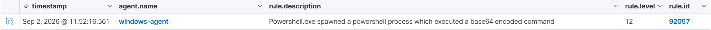
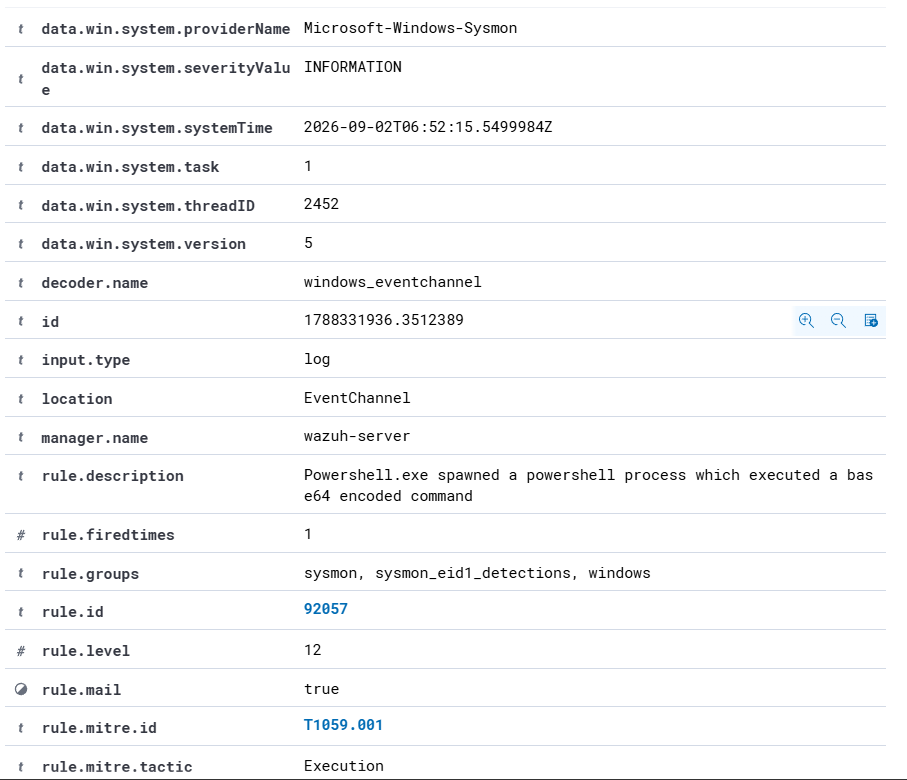

# Scenario 06 — Sysmon Encoded PowerShell Detection

## Objective

Detect suspicious PowerShell execution using Sysmon process-creation telemetry and Wazuh detection rules.

This scenario demonstrates how Sysmon provides detailed Windows process telemetry, including command-line arguments, and how Wazuh analyzes that telemetry to identify encoded PowerShell execution.

---

## Environment

| Component | Details |
|---|---|
| Endpoint | Windows 10 |
| Endpoint Agent | Wazuh Agent |
| Telemetry Source | Sysmon |
| Sysmon Log Channel | Microsoft-Windows-Sysmon/Operational |
| Detection Platform | Wazuh |
| Sysmon Event ID | 1 - Process Create |
| Wazuh Rule | 92057 |
| Alert Level | 12 |
| MITRE ATT&CK | T1059.001 - PowerShell |
| Tactic | Execution |

---

## Sysmon Integration

Sysmon was installed on the Windows endpoint to provide enhanced process activity visibility.

The following event channel was added to the Wazuh agent configuration:

```xml
<localfile>
  <location>Microsoft-Windows-Sysmon/Operational</location>
  <log_format>eventchannel</log_format>
</localfile>
```

This configuration allows the Wazuh agent to collect Sysmon events and forward them to the Wazuh manager for analysis.

The repository copy of this configuration is available at:

`configs/windows-sysmon-wazuh-config.xml`

---

## Baseline Validation

Before simulating suspicious activity, a harmless PowerShell command was executed to verify that Sysmon Process Create events and command-line arguments were being collected successfully.

```powershell
powershell.exe -NoProfile -Command "Write-Output 'SOC-SYSMON-TEST'"
```

Sysmon generated Event ID `1`, confirming process-creation telemetry was available to Wazuh.

The event contained the executable path and complete PowerShell command line.

---

## Controlled Suspicious Activity

A harmless Base64-encoded PowerShell command was executed:

```powershell
powershell.exe -NoProfile -EncodedCommand VwByAGkAdABlAC0ATwB1AHQAcAB1AHQAIAAiAFMATwBDAC0AUwBZAFMATQBPAE4ALQBFAE4AQwBPAEQARQBEAC0AVABFAFMAVAAiAA==
```

The encoded content resolves to:

```text
Write-Output "SOC-SYSMON-ENCODED-TEST"
```

The command was intentionally harmless and used only to generate controlled suspicious telemetry for detection validation.

---

## Detection Result

Wazuh successfully detected the encoded PowerShell execution.

Observed alert:

| Field | Value |
|---|---|
| Rule ID | 92057 |
| Alert Level | 12 |
| Description | Powershell.exe spawned a powershell process which executed a base64 encoded command |
| Sysmon Event ID | 1 |
| Provider | Microsoft-Windows-Sysmon |
| Process | powershell.exe |
| MITRE ATT&CK | T1059.001 - PowerShell |
| Tactic | Execution |



---

## Event Investigation

The Wazuh event details confirmed that the alert was generated from Sysmon telemetry.

Important fields included:

- Provider: `Microsoft-Windows-Sysmon`
- Event ID: `1`
- Process: `powershell.exe`
- Command-line argument: `-EncodedCommand`
- Wazuh Rule: `92057`
- Alert Level: `12`
- MITRE ATT&CK Technique: `T1059.001`
- Tactic: `Execution`



The captured command line demonstrated that Sysmon provided visibility not only into the process executable but also into the arguments used during execution.

---

## Detection Flow

The detection sequence was:

1. PowerShell executed an encoded command.
2. Sysmon monitored the process creation event.
3. Sysmon generated Event ID `1`.
4. The Wazuh agent collected the Sysmon Operational event.
5. The event was forwarded to the Wazuh manager.
6. Wazuh analyzed the Sysmon telemetry against its detection rules.
7. Rule `92057` identified Base64-encoded PowerShell execution.
8. A Level 12 security alert was generated.

---

## MITRE ATT&CK Mapping

**Tactic:** Execution

**Technique:** T1059.001 - PowerShell

PowerShell is a legitimate administrative tool but can also be abused to execute commands, scripts, and encoded payloads.

The presence of `-EncodedCommand` can be an important detection indicator because attackers may use encoded commands to make activity less readable during execution.

---

## Analyst Assessment

**Verdict: True Positive - Authorized Lab Simulation**

The detection was a true positive because the encoded PowerShell command was intentionally executed on the Windows endpoint and the observed Wazuh alert directly matched the generated activity.

The command itself was harmless and only printed a test string.

No malicious payload, persistence mechanism, credential theft, or external network activity was executed as part of this scenario.

---

## Recommended Investigation

In a production environment, an analyst investigating similar activity should:

- Review the complete PowerShell command line.
- Decode the encoded content in a safe analysis environment.
- Identify the user account responsible for execution.
- Review the parent and child processes.
- Determine whether the execution was expected administrative activity.
- Search for additional PowerShell activity around the same timestamp.
- Review network connections created by the process.
- Check for related file, registry, or persistence activity.
- Correlate the event with endpoint and authentication telemetry.

---

## Recommended Remediation

If the activity is confirmed as malicious, recommended response actions include:

- Isolate the affected endpoint if compromise is suspected.
- Terminate confirmed malicious processes.
- Remove malicious scripts or payloads.
- Investigate the executing user account for compromise.
- Reset credentials if credential theft is suspected.
- Restrict unnecessary PowerShell usage where operationally appropriate.
- Enable appropriate PowerShell logging and monitoring.
- Use application-control policies where required.
- Continue monitoring the endpoint for additional suspicious execution.

---

## Conclusion

Sysmon successfully provided detailed Windows process-creation telemetry to Wazuh.

Wazuh analyzed the Sysmon Event ID `1` data and detected Base64-encoded PowerShell execution using Rule `92057`, generating a Level 12 alert mapped to MITRE ATT&CK technique `T1059.001`.

This scenario demonstrates enhanced endpoint visibility and detection by combining Sysmon telemetry with Wazuh security analytics.